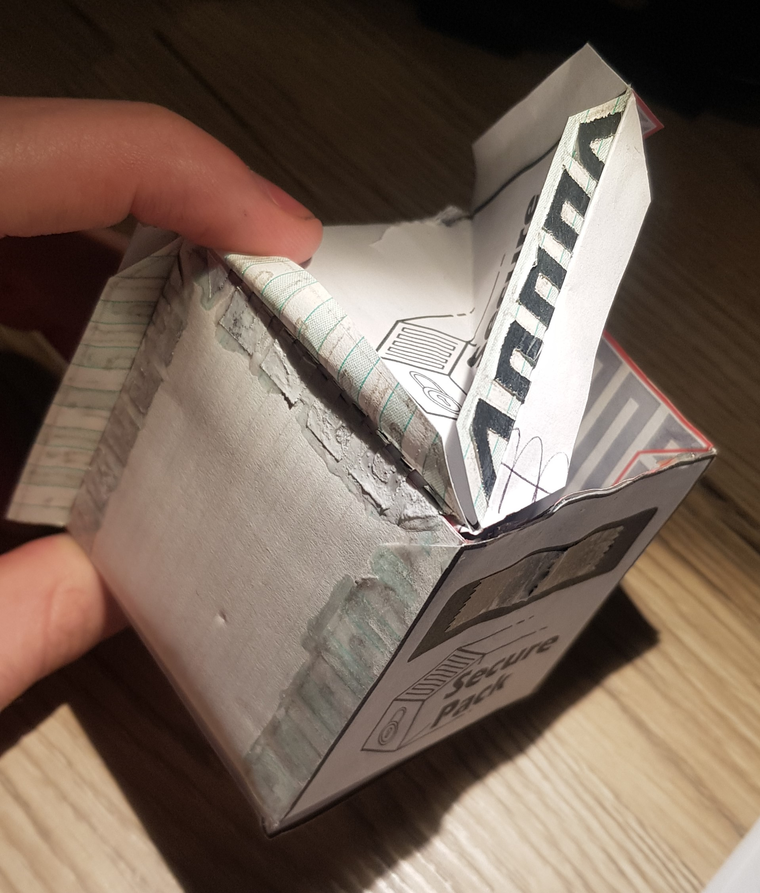
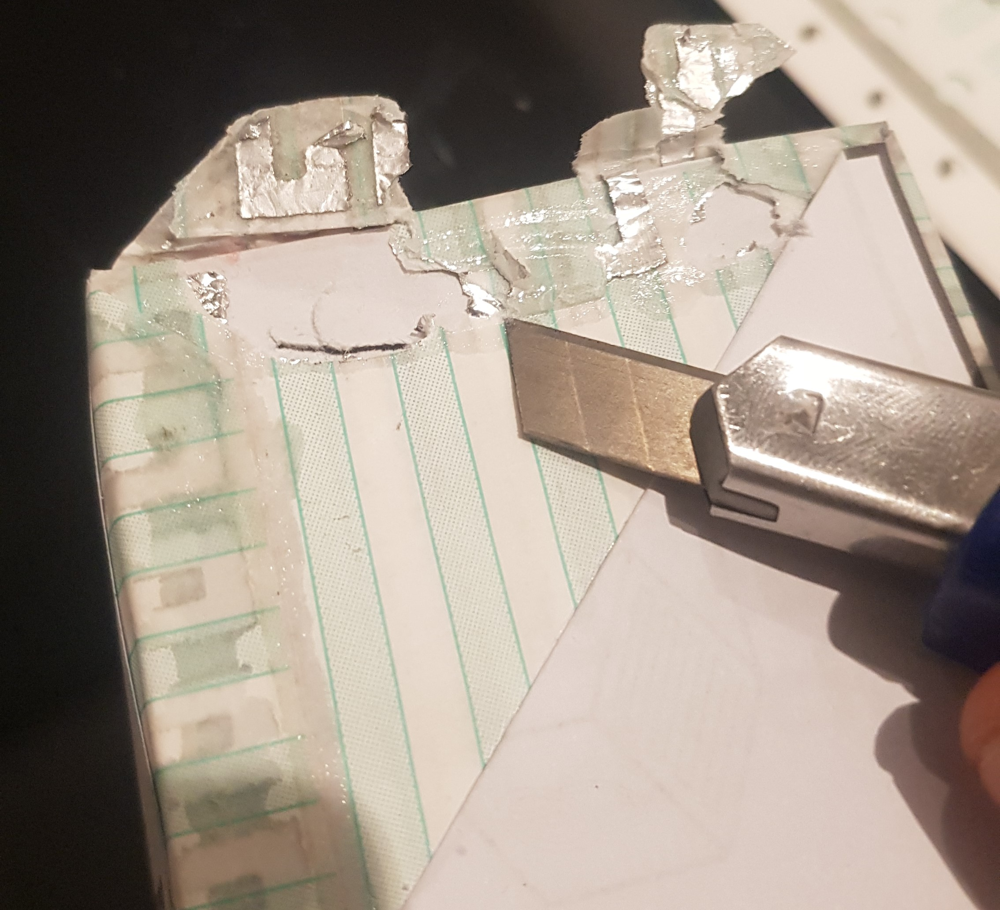
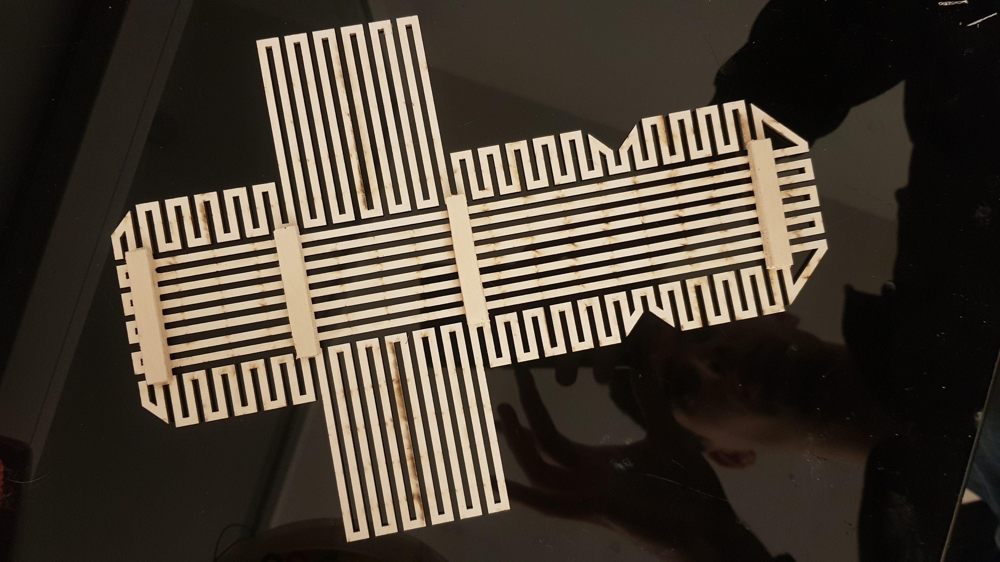
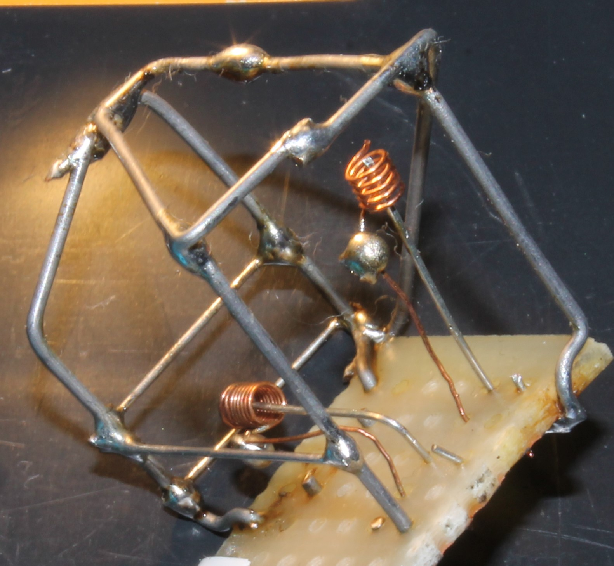

## About

This repo id for the "Gestione dell'innovazione e dei progetti" ("Innovation and Project Management") UNIBO course

Canva link to the SecurePack's presentation:
https://www.canva.com/design/DAFUEDHyLhg/GkpVW-ylKPgNlXIH7wrgjQ/view?utm_content=DAFUEDHyLhg&utm_campaign=designshare&utm_medium=link2&utm_source=sharebutton

The goal of this project was to come up with an innovative and commercially feasible idea for a business operating in the packaging sector. The product has to be "smart" in one way or another. So we opted for a new type of "security" package capable of:
- detecting tampering
- detecting too strong impacts during transportation
- digitally prove the authenticity of the goods
The idea is that the user "scans the package" with an app to detect whether or not one (or more) of the above anomalies occurred.

To better illustrate and verify the feasibility of this idea, a proof of concept was constructed. The actual package consists of paper and a metal wiring covering the entire surface of the package. Should the package be opened or tampered with, the metal jacket would vary in resistance, and thus trigger the electronic circuit to flip the relevant bit, which will ultimately notify the user about the manumission during the next scan.

https://user-images.githubusercontent.com/42840531/217094010-be9d4fd1-da9f-4857-b5de-21de0359c7cd.mp4

https://user-images.githubusercontent.com/42840531/217095624-7ae99151-60c2-41f5-ace8-7a2b68c8901c.mp4

And while the packaging could be easily manufactured using one of these [numerically controlled plasma cutters](https://www.google.com/search?q=numerically+controlled+plasma+cutter), we had to be creative in order to realize our prototype without using such advanced equipment, so we had our fun figuring out this way of cutting aluminium tracks directly on the paper support XD

https://user-images.githubusercontent.com/42840531/217094157-72ae5bf2-e1db-4025-afab-37052cc5f302.mp4

One way we think the cost of the solution can be reduced is to encourage schemes in which the electronic part can be reused for further expeditions, or use the electronics for something useful to be embedded in the product itself after the package has fulfilled its utility. Furthermore, innovative ways of communication between SOC and smartphone could be implemented in order to reduce the cost due to NFC o Bluetooth connectivity needed for the scanning. For example, the use of the smartphone camera decoding light pulses from an LED on the device can be a viable solution to receive small amounts of data without any additional RF electronics! Likewise, the smartphone flashlight can be used to send data towards a phototransistor on the device.
With regards to the shock sensor, this turns out to be very simple and cheap: it's just 2 contacts closing if a certain G acceleration is detected

